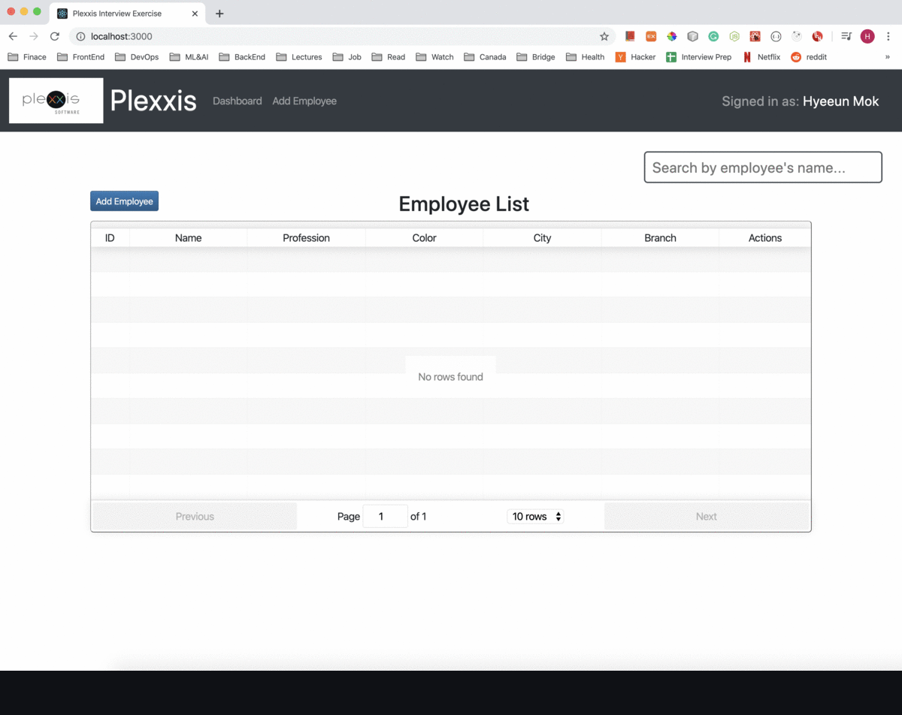

# Employee Management System

## Overview
An employee management system consisting of crucial work-related and important personal information about employees. Human Resources (HR) can manage their employees efficiently using this web application.

## Purpose
I created an online employee management system web application that will allow users can add, edit, update, search and delete employees. It will also allow Admin update code and assigned sections using an Admin dashboard (Admin page will be implemented in the future).

## Functionalities:

**1. Add employee information:**  
&nbsp; &nbsp; * Name  
&nbsp; &nbsp; * Profession  
&nbsp; &nbsp; * Color  
&nbsp; &nbsp; * City  
&nbsp; &nbsp; * Branch  

**2. Edit and Delete:**  
 Be able to edit and delete employees from the database. An employee's details are automatically populated when the user clicks the edit button

**3. Search:**  
 Be able to search (an) employee(s) by their first name, last name, and full name

**4. Display employees:**  
 Be able to retrieve employees from a REST API and display them
 
**5. REST API:**   
  Built REST API using node.js and Express to implement above functionalities

## Used technologies:
&nbsp; &nbsp; * React  
&nbsp; &nbsp; * Node.js  
&nbsp; &nbsp; * Express  
&nbsp; &nbsp; * SQLite  
&nbsp; &nbsp; * REST API  
&nbsp; &nbsp; * React-Table  
&nbsp; &nbsp; * React-Bootstrap  
&nbsp; &nbsp; * Axios  
&nbsp; &nbsp; * Cors  
&nbsp; &nbsp; * Nodemon  
&nbsp; &nbsp; * Styled-components  
&nbsp; &nbsp; * ESLint  
&nbsp; &nbsp; * Prettier  

## How to run:

&nbsp; &nbsp; 1. npm install  
&nbsp; &nbsp; 2. npm start   

The front-end app runs on localhost:3000. The REST API is located in the /server folder and runs on localhost:8080. The data is being served by index.js located n the /server/index.js and actual data from a plexxis.db is located in the /server/repo folder (if it does not exist, it will be created when the application is run for the first time). Run "npm start" to start both servers.
